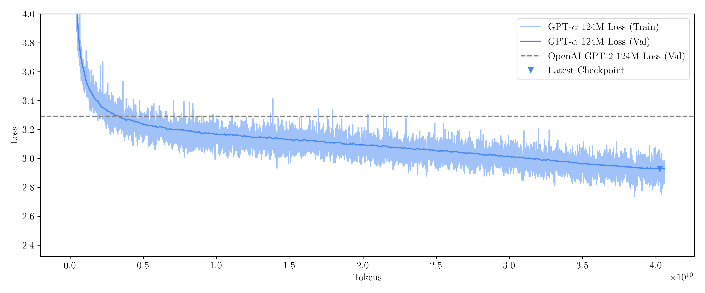
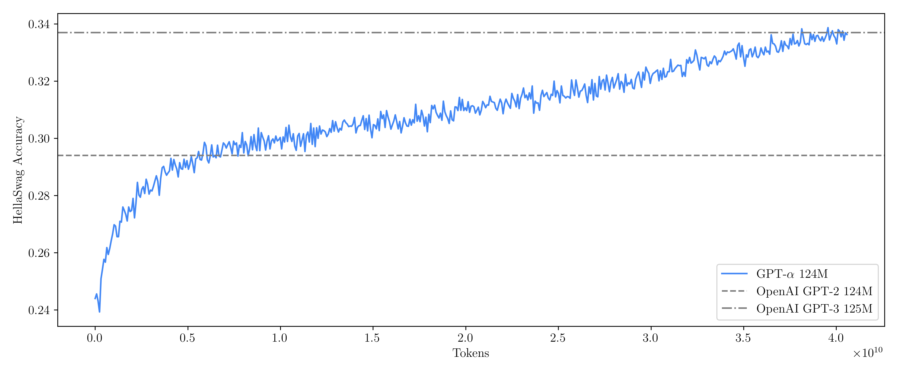

# GPT-α
A full implementation of a Generative Pre-trained Transformer (GPT) model following the architecture of OpenAI's [GPT-2](https://cdn.openai.com/better-language-models/language_models_are_unsupervised_multitask_learners.pdf) and [GPT-3](https://arxiv.org/abs/2005.14165) models as well as [nanoGPT](https://github.com/karpathy/nanoGPT) by Andrej Karpathy. The model is implemented in PyTorch and supports both single-GPU and multi-GPU training. The model is trained on the 10B token subset of [fineweb-edu](https://arxiv.org/pdf/2406.17557), a large-scale dataset of educational content. The model can be found on the Hugging Face Model Hub [here](https://huggingface.co/fraserlove/gpt-alpha).

The model surpasses GPT-2 124M on [HellaSwag](https://arxiv.org/pdf/1905.07830) after just 5B tokens and surpasses GPT-3 125M after 38B tokens. This is a 20x improvement over GPT-2 124M and 7.8x improvement over GPT-3, which were trained on 100B tokens and 300B tokens respectively. Training the model for 1 epoch of the 10B fineweb-edu subset, with a batch size of 16, took ~3.5 hours on 8x A100-SMX4 40GB GPUs.




Here are some example completions from the 124M model after training on 40B tokens. The context is *`Once upon a time,'*. The completions are generated using the top-k sampling strategy with a maximum length of 64 tokens, a temperature of 1.0 and a k value of 50.

```
Once upon a time, people were going to buy the “cork” that was used to wrap and hang the wine.
However, what began to be called “cork” as soon as the time rolled around was probably an artificial wine. This is how we know cork as the “cork”

Once upon a time, there was a time in the history of India when the great religion of India was worshipped by only two people… the Hindus and the Jains. This is the story of how the story of India was created.
India’s story begins with a very ancient Vedic religion. They were the ancient Indus valley

Once upon a time, the King of Italy, who was to govern what would become the world, thought that it would be a great and noble undertaking to introduce the Roman Senate into the country in order to defend Rome — to defend her own capital in a very civilized manner, to promote the arts and promote the Roman religion. Accordingly, Rome,
```

## Installation and Usage
Run the following to install the GPT and its required dependencies:
```bash
git clone https://github.com/fraserlove/gpt-alpha.git
cd gpt
python -m venv .venv
source .venv/bin/activate
pip install -r requirements.txt
```

### Tokenisation
The `gpt2` tokeniser within the `tiktoken` library is used as the default tokeniser, however, a custom tokeniser is available within `gpt.tokeniser`. To train the custom tokeniser on the first 10,000 documents in the `fineweb-edu` dataset, run the following command:
```bash
python gpt/tokeniser.py
```
The custom tokeniser is saved as `gpt.tkn`. To use the custom tokeniser, replace `tiktoken.get_encoding('gpt2')` with `GPTTokeniser('gpt.tkn')` in `gpt/tokeniser.py`.
Note that the same tokeniser used when importing the `fineweb-edu` dataset must be used during training as otherwise the encodings will not match.

### Dataset
The fineweb-edu dataset is used as the dataset for training the GPT model as it is a large-scale, high quality dataset of educational content. By default, the `sample-10B` version of the dataset is used, which contains 10B tokens. The dataset is available on the Hugging Face Datasets Hub and can be downloaded using the `datasets` library. The dataset is tokenised and stored in shards in the `cache/fineweb_edu_10B` directory. To download the dataset and tokenise into shards, run the following command:
```bash
python fineweb.py
```
The dataset is loaded via the `gpt/dataloader.py` script. This script loads the dataset from the shards, shuffling the shards and also shuffling the documents within each shard. The script then concatenates the documents and loads them into batches.

### Training
The GPT model can be trained using the `train.py` script. The script supports both single-GPU and multi-GPU training using data parallelism. The model is trained using a custom training loop with a learning rate scheduler and gradient clipping as per GPT-3.

To run on a single GPU, use the following command:
```bash
python train.py
```

To run on multiple GPUs, use the following command:
```bash
torchrun --standalone --nproc_per_node={n_gpus} train.py
```
where `n_gpus` is the number of GPUs to use in training.

### Evaluation
During training [HellaSwag](https://arxiv.org/pdf/1905.07830) is used to evaluate the GPT model. To evaluate any model from HuggingFace on the HellaSwag dataset, run the `hellaswag.py` script:
```bash
python hellaswag.py -m {hf_user}/{hf_model}
```
Analysis of training the model, including plots of the loss trajectory and HellaSwag score throughout training, is performed
within `eval/train_eval.ipynb`.

A full evaluation can be performed by running the [Eleuther LM Evaluation Harness](https://github.com/EleutherAI/lm-evaluation-harness). In order to run the evaluation harness the model must be exported to a HuggingFace transformer model. This is achieved via the `save_pretrained()` method within GPT which saves the model weights to a HuggingFace GPT-2 model, transposing the relevant tensors. For example, `attn.c_proj.weight` must be transposed because it was initially used as weights withing a Conv1D module rather than a Linear module. This has already been done and the model is avaliable on HuggingFace Hub [here](https://huggingface.co/fraserlove/gpt-alpha). Now download the Eleuther LM Evaluation Harness to perform evaluation on this model. Run the following to download and install it.
```
git clone https://github.com/EleutherAI/lm-evaluation-harness/
cd lm-evaluation-harness
git checkout 0571eeb14d4e48aac51956a726c62cd8b382b3d8
pip install -e .
```
Then the evaluation script, which contains code to run various evaluation tasks on a HuggingFace model, can be invoked with:
```
cd eval/
./run_eval.sh {hf_user/hf_model1} {hf_user/hf_model2} ... {hf_user/hf_modelN}
```
Specifically to perform evaluation on this model, run `./run_eval.sh fraserlove/gpt-alpha` within the `eval/` directory. This script will write evaluation json objects under the evaluation folder and will finish by printing the evaluation results using `python eval_results.py fraserlove/gpt-alpha`. This script can be rerun from within `eval/` to display these results at any time. Evaluation usually takes roughly an hour to run per model. Below is an example output from evaluation with `./run_eval.sh ./run_eval.sh fraserlove/gpt-alpha gpt2 EleutherAI/gpt-neo-125m facebook/opt-125m EleutherAI/pythia-160m`


```
+----------------------+-----------+-------+--------------+----------+-------------+
|      Benchmark       | gpt-alpha | gpt2  | gpt-neo-125m | opt-125m | pythia-160m |
+----------------------+-----------+-------+--------------+----------+-------------+
| commonsenseqa_0shot  |   19.16   | 19.57 |    19.57     |  19.98   |    19.90    |
|      piqa_0shot      |   63.06   | 62.51 |    62.46     |  62.08   |    61.26    |
|      siqa_0shot      |   38.18   | 36.59 |    37.21     |  37.21   |    36.69    |
|   openbookqa_0shot   |   29.80   | 27.20 |    26.20     |  28.00   |    27.00    |
|    triviaqa_0shot    |   1.31    | 0.30  |     0.66     |   1.18   |    0.41     |
|   truthfulqa_0shot   |   33.13   | 31.73 |    35.70     |  33.50   |    34.75    |
|      mmlu_5shot      |   23.30   | 25.90 |    25.58     |  25.94   |    25.10    |
|   winogrande_5shot   |   50.20   | 50.04 |    51.70     |  51.07   |    48.78    |
| arc_challenge_25shot |   29.18   | 22.95 |    22.87     |  22.10   |    22.10    |
|   hellaswag_10shot   |   35.74   | 31.64 |    30.58     |  31.69   |    30.15    |
|     gsm8k_5shot      |   2.27    | 0.68  |     1.74     |   1.74   |    2.20     |
|    Average Score     |   29.58   | 28.10 |    28.57     |  28.59   |    28.03    |
+----------------------+-----------+-------+--------------+----------+-------------+
```

### Inference
The GPT model can be used for inference using the `inference.py` script. The script generates completions given a context. The completions are generated using the top-k sampling strategy. The maximum length of the completions, temperature and k value can be set in the script. Alternatively, the model is available on the Hugging Face Model Hub [here](https://huggingface.co/fraserlove/gpt-alpha) for use in the Hugging Face Transformers library allows inference to be performed in three lines of code.
